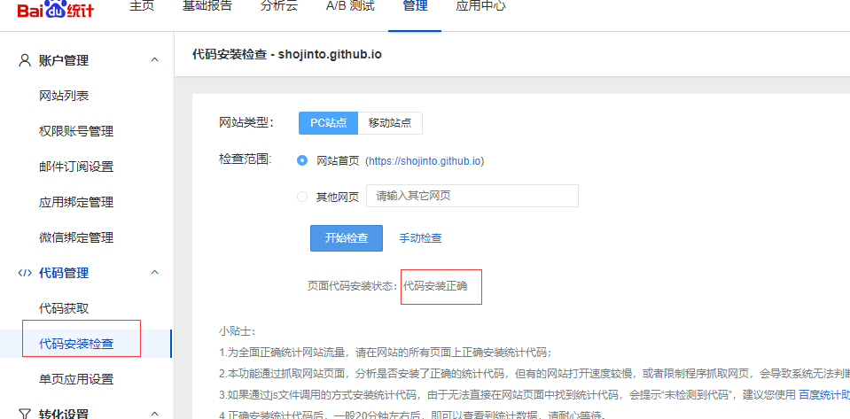

# 我的个人博客

本博客是采用`Hexo+geek`搭建而成，之前采用`Jekyll+Chirpy`搭建但是由于我解决不了`Jekyll`对于 ``标签的不兼容性，所以选择了`Hexo`。对于想要了解`Jekyll+Chirpy`版本的请移步：[`Jekyll+Chirpy`](https://github.com/ShoJinto/shojinto.github.io/tree/rdm)

这里记录个人的一些杂七杂八。。。。


- 添加百度统计

  之前`Jekyll`站点使用的是Google统计，原本是没有啥访问量的，刚刚打开看了一下还有点儿访问量。所以这里将统计改为百度统计，后期在有闲心的时候才去折腾Google统计了。

  因为，之前的主题再带Google统计，配置比较简单。这次采用的主题没有自带统计功能，于是自己操刀，添加了百度统计的插件，记录一下插件的创建过程

  首先看下目录结构

  ```shell
  └─themes
      │  .gitkeep
      │
      └─geek
      	│  _config.yml
          ├─ ...
          ├─layout
          │  │  index.ejs
          │  │  layout.ejs
          │  │  post.ejs
          │  │
          │  └─_partial
          │          baidu_analytics.ejs
          │          footer.ejs
          │          head.ejs
          │          nav.ejs
  ```

  1. 申请百度统计账号

  2. 在`themes/geek/layout/_partial`目录下新建一个`baidu_analytics.ejs`文件

     内容如下：

     ```html
     <% if (theme.baidu_analytics.enable){ %>
     	<script>
     	var _hmt = _hmt || [];
     	(function() {
     	  var hm = document.createElement("script");
     	  hm.src = "https://hm.baidu.com/hm.js?<%= theme.baidu_analytics.appId %>";
     	  var s = document.getElementsByTagName("script")[0]; 
     	  s.parentNode.insertBefore(hm, s);
     	})();
     	</script>
     <% }%>
     ```

  3. 在`head.ejs`文件的`</head>`标签前面加入`<%- partial('baidu_analytics') %>`

  4. 在`themes/geek/_config.yml`中新增如下配置项

     ```yaml
     # Analytics
     baidu_analytics: 
       enable: true
       appId: <百度统计生成的appId>
     ```

  5. 保存并推送到远程仓库在百度统计页面检测返回如下结果则说明插件已经生效

     


​	静待。。。。