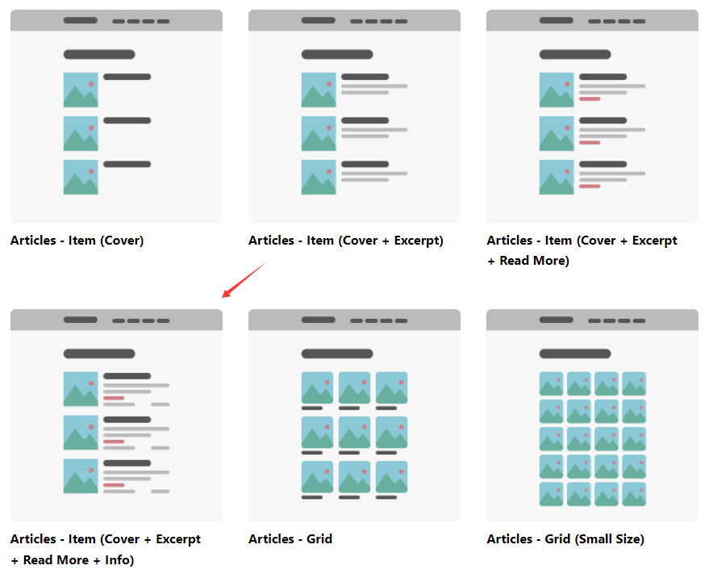

借助搜索引擎完成自己个人博客的搭建。

主要因为自己忘性越来越好 :) 为了不至于今后自己做过的一些事情自己都一无所知。

<!--more-->

---

#### 选择`Jekyll-Chirpy`的理由

- 美观,开箱急用
- 帮助文档虽然英文，但是还能凑合

#### 符合`Chirpy`规范的文章写作指南

[如何在Chripy上写文章](https://chirpy.cotes.page/posts/write-a-new-post/)

等啥时候自己对`Jekyll`这个工具了解更多点儿再来整理吧，就目前来说能够将`markdown`文档通过`github.io`发布就行了。

#### 搭建总结

具体搭建以及布局跟着官文 step by step 即可。备忘的重点在如何开始利用markdown编写一篇符合`jekyll`规范的blog。这些`Chirpy`主题已经帮助解决了，作为用户的我只需要将心思放在写作内容上即可。

其实在选择`Chirpy`这款主题之前我还尝试了另外一款`teXt-theme`风格也会这款的`dark`风格差不多，而且我还在上面写了一篇示例文章。但是最终为什么没有使用[`teXt-thems`](https://tianqi.name/jekyll-TeXt-theme/samples.html)呢？其实就是因为看了他的示例效果图，我想把博客首页给弄成如下标记的样式：

但是我看了很久的文档尝试很多次（自己太菜）没有把作者的示例和`Jekyll`的`collections`搞明白，效果弄不出来自然也就放弃了。回头想来我主要是为了写东西，又不是做网站。只要大体上符合自己的要求就行。于是我的第一批博客文章就这样产生了。加油！！