# RDM 从源码编译

Redis Desktop Manager -> **RDM** 一个超赞的`redis`开源客户端管理工具。感谢项目的作者[`@uglide`](https://github.com/uglide/RedisDesktopManager)，一个软件从源码到编译也不是一件容易的事情。所以有条件且嫌麻烦的朋友可以直接去官网购买[https://resp.app/pricing](https://resp.app/pricing)。

### 环境准备

根据官文[Build from source](http://docs.redisdesktop.com/en/latest/install/#build-from-source)准备所需依赖

- [Visual Studio 2019 Community Edition](https://visualstudio.microsoft.com/vs/)
- [Qt 5.15.x](https://www.qt.io/download)
- [Python3.9+](https://www.python.org)
- [Git](https://git-scm.com/downloads)
- Windows 10 x64
- [cmake](https://cmake.org/download/) 、[make](http://www.equation.com/servlet/equation.cmd?fa=make) 、[nuget](https://www.nuget.org/downloads)

接下来对上面的提到的依赖进行逐一破解。

本着先易后难的原则`VS2019`、`git`、`python39`这三个软件都是常用软件不做过多介绍，需要说明的安装`VS2019`的时候必须现在`C++`载荷因为**RDM**使用`C++`开发的。

分别去[`https://cmake.org/download/`](https://cmake.org/download/)、[`http://www.equation.com/servlet/equation.cmd?fa=make`](http://www.equation.com/servlet/equation.cmd?fa=make)、[`https://www.nuget.org/downloads`](https://www.nuget.org/downloads)这三个地方把`cmake`、`make`和`nuget`下载到本地并添加到系统环境变量中,追加到`%path%`上，在找make for windows 命令的时候发现这篇关于[windows上make和cmake命令的集成](https://zhuanlan.zhihu.com/p/149305469)说的比较好。

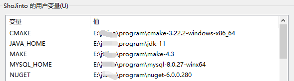

接下来就是按照官网[在windows上编译](http://docs.redisdesktop.com/en/latest/install/#build-from-source)小节`step by step`。在这期间自己犯了一个非常严重且愚蠢的错误，在上面起码耗费了4个小时甚至还跑到RDM的GitHub上提交[issue](https://github.com/uglide/RedisDesktopManager/issues/5184)。究竟怎么回事儿请继续往下看！！！

### 编译lz4

根据官网说明进行操作，需要注意的时候Windows上执行make命令会报错：

```shell
/WorkSpace/rdm/3rdparty/lz4/build/cmake $ make
make: *** No targets specified and no makefile found.  Stop.
```

解决办法是：直接用VS2019进行编译。

编译过*程极度舒适*进入`lz4/build/cmake`目录双击`LZ4.sln`解决方案文件默认用VS2019打开。按照如下截图操作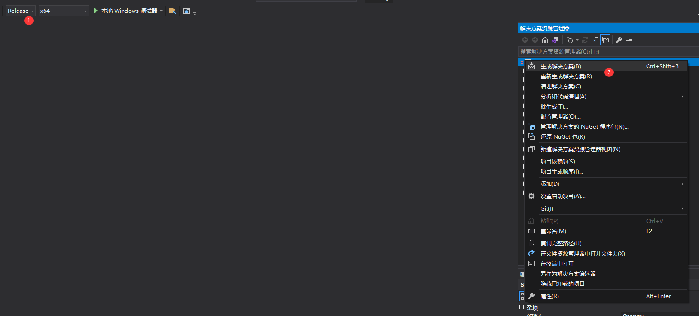

等待编译完成即可。

### 使用Qt Creator 构建rdm项目

由于Qt从5.15开始不提供离线安装包，在GFW内无疑是阻碍了丝滑度。所以我这边一股脑儿的想要找到5.15的离线按照包。找来找去对本次编译唯一有用的是发现了这个[网站](http://dts.digitser.cn/zh-CN/download/qt/qt5.html#Qt5)如果要学习Qt她绝对是国内不二的选择，根据上面的介绍如果要得到5.15的离线安装包就需要自行编译，这个的编译成本非常之高。究竟有多高，看看在你这里就知道了[[在 Windows 10 编译 Qt 5.15 源代码的详细过程 步骤详解](http://wiki.digitser.cn/zh-CN/qt/compile5.15.html#)]。哇哇哇哇~~~~ 这么多依赖，关键是对于一个不进行Qt开发的人来说这么一次编译成本未免也太大了。果断选择其他方式。也许是快过年了头脑以己经开始了休假模式，一不留神把看成了

心想不是说不开放离线按照包么，怎么被我找到了呢。这就是我在RDM的GitHub上[issue](https://github.com/uglide/RedisDesktopManager/issues/5184)的开端。具体问题欢迎[强势围观](https://github.com/uglide/RedisDesktopManager/issues/5184)。

心情开始烦闷了。。。。。正好午饭时间到，去食堂解决一下口腹之欲再说。

午休间隙突然发现，明明官文上说的是*Qt5.15*我这里怎么是**Qt5.14.2**，这不是自己搞错了么还跑去提*issue*丢人丢到家了。怎么搞呢，`5.15`没有离线安装，哎~~~ 为了把RDM编译成功我也是拼了。哈哈哈~ ~ ~ 拿出我珍藏多年的梯(dai)子(li)去Qt官网的[`5.15`下载站点](https://download.qt.io/archive/qt/5.14/5.14.0/)将在线安装包下载下来进行安装。

安装的时候按照如下截图选择主键即可：

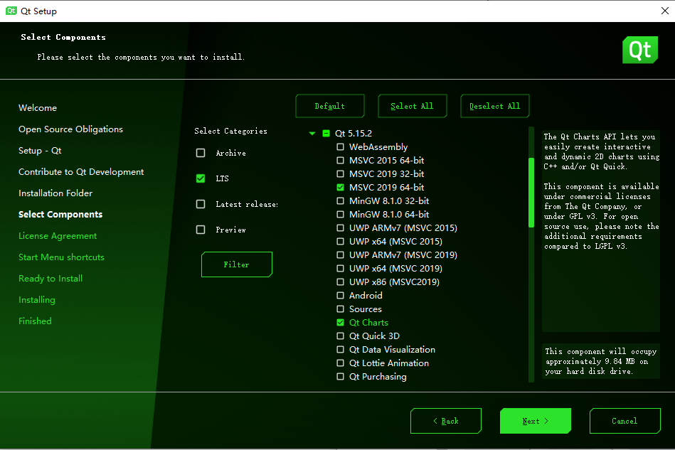

等待安装完成即可。

#### 修改项目文件以符合实际情况

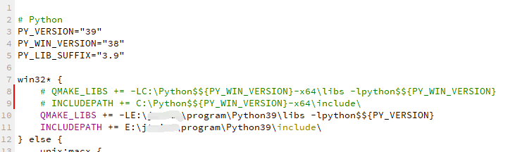

被注释掉代码是原有的，需要修改成实际python的地址。

### 更新语言

如果不做此操作编译后的程序默认是英文的

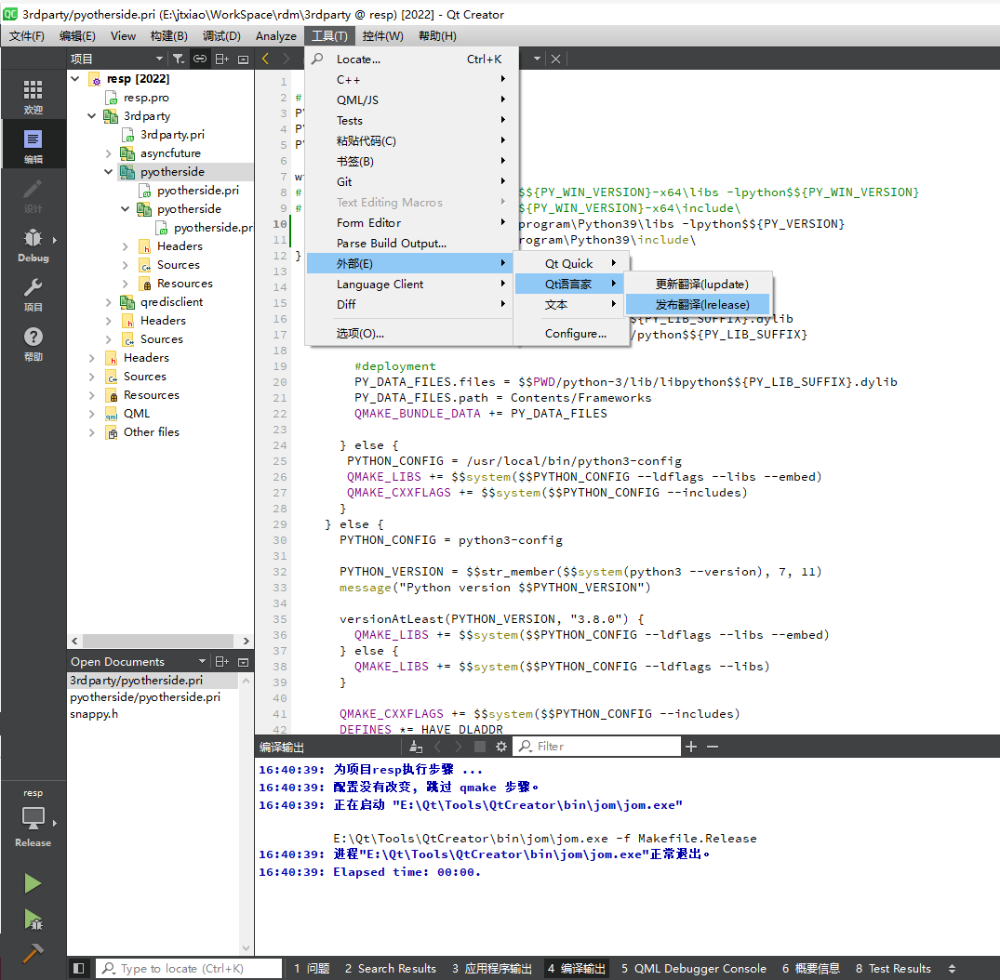

**Run build. (Just hit `Ctrl-B`)**

### 解决其他依赖

观察`Qt Creator`的信息输出窗口没有出现之前的

```shell
E:\WorkSpace\rdm\src\app\models\connectionsmanager.cpp:133: error: C2027: 使用了未定义类型“QUuid”
E:\WorkSpace\rdm\3rdparty\qredisclient\src\qredisclient\connectionconfig.h:120: error: C2027: 使用了未定义类型“QSet<T>”
with
[
    T=QString
]
E:\WorkSpace\rdm\src\app\models\connectionsmanager.cpp:133: error: C3861: “createUuid”: 找不到标识符

E:\WorkSpace\rdm\src\app\models\connectionsmanager.cpp:133: error: C2027: 使用了未定义类型“QUuid”
```

类似报错了，心想总算进入了实质性的编译阶段了。但是。。。。。

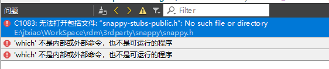

根据错误提示定位到第三方模块`snappy`经过一番查找发现只有`snappy-stubs-public.h.in`文件，我不懂C/C++抱着试一试的想法把这个模块编译一下。查看其`README.md`与编译相关信息可以得知该模块是如何编译的：

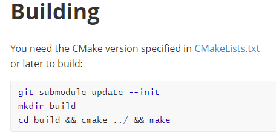

因为是在Windows平台所以这里仅仅执行到`cmake`就需要切换到`VS2019`上进行最后的的`make`操作。在这过程中在`build`目录下发现了所需要的`snappy-stubs-public.h`文件。省去make步骤直接把它拷贝到`snappy.h`同级目录。再在`Qt Creator`中执行Build操作。但是。。。还是但是。。。。

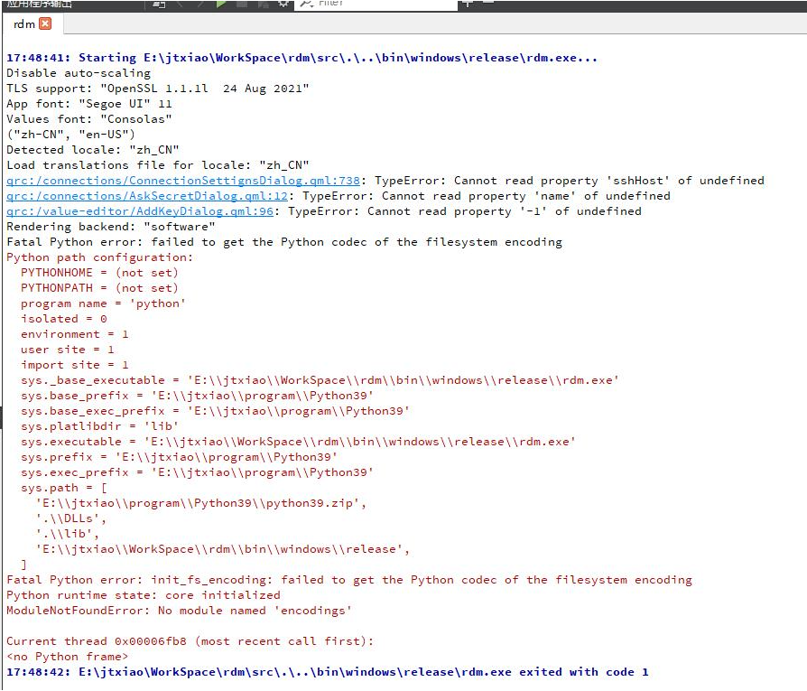

明明之前都把python的绝对路径写死在代码里面了，这会儿怎么又冒出这个python相关的问题，看错误信息

	## Fatal Python error on Windows 10 ModuleNotFoundError: No module named 'encodings'

用`ipython`测试一下：

```shell
$ ipython
Python 3.9.7 (tags/v3.9.7:1016ef3, Aug 30 2021, 20:19:38) [MSC v.1929 64 bit (AMD64)]
Type 'copyright', 'credits' or 'license' for more information
IPython 7.30.1 -- An enhanced Interactive Python. Type '?' for help.

In [1]: import encodings

In [2]:
```

没有问题呀！怎么回事儿。好！是时候请出Google大神了

找到了一篇文章[Windows 10上的致命Python错误ModuleNotFoundError：没有名为’encodings’的模块](https://www.codenong.com/42512817/)根据文章的说明新建两个环境变量`PYTHONHOME=E:\program\python39`和`PYTOHNPATH=E:\program\python39\Scripts`然后重启`Qt Creator`让配置的新环境变量生效。然后继续编译，好事多磨，这次编译又报出

好在问题越来越具体和清洗了，**根据报错信息定位到`3rdparty`模块的对应目录，找到他的`README.md`文件查看该库是如何编译以及使用的**。依据其README.md，项目已经在`zstd/build/cmake/`中提供了`cmake`的项目生成器，可以生成`Makefile`或者编译脚本。那么直接转到该目录下执行`cmake`命令即可生成编译脚本，然后使用VS2019编译出对应的生成物，然后将生成物拷贝的依赖提示的位置接下来的错误均是按照此操作进行

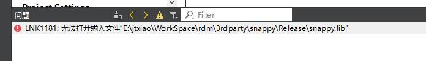

此处还有一个报错，不像前面的报错可以清洗的知道属于哪个第三方模块所在的目录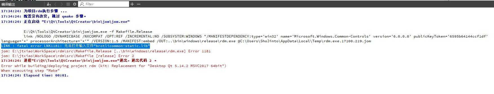

这么办呢，好在我这里收藏的神器比较多，铛铛铛铛铛~~~~`everything`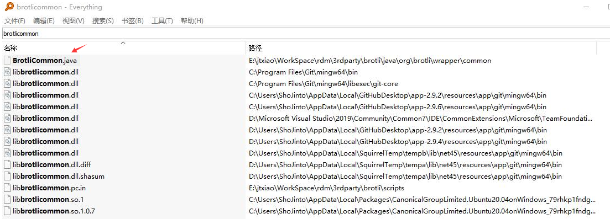

咿~~~~ 这货是个 `java` ，翻看其`README.md`果然不同寻常，难道我还要去搞个`mvn`来编译这货。。。。结果让我失望了，他提供了`cmake`编译方式：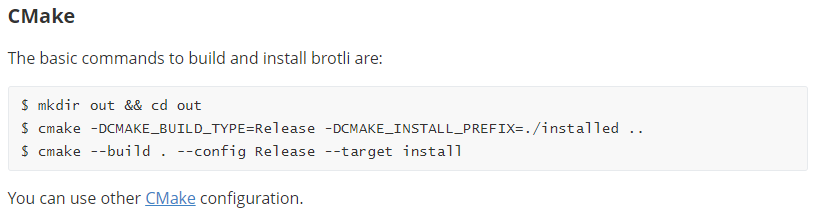

通过`cmake`也能编译。好吧，执行上面的命令，进行编译，编译完成将`out/Release`目录拷贝的插件的根目录下也就是`README.md`同级目录。

### 编译成功

千呼万唤始出来。。。

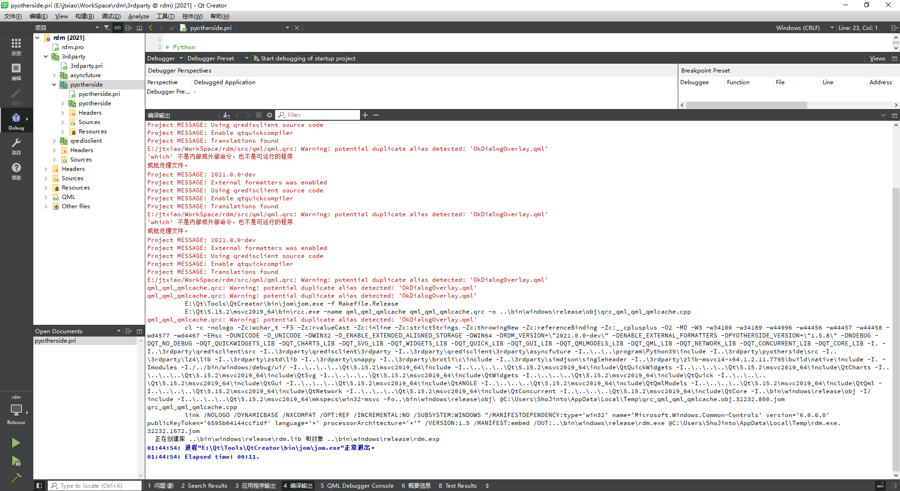

 ### 软打包

到`rdm\bin\windows\release`去执行一下`rdm.exe`看看效果。┭┮﹏┭┮ 呜呜~~~~ 不带这么玩儿的呀！！

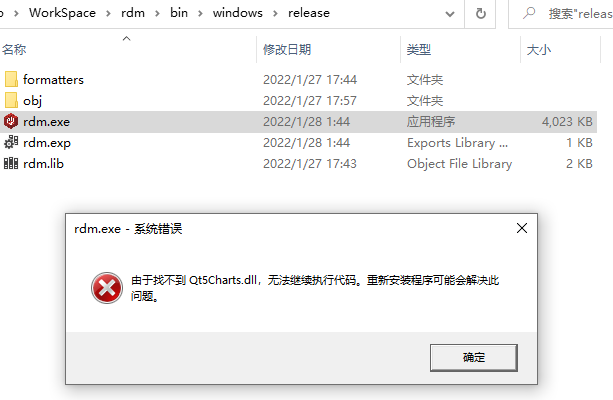

在`Qt Creator`里面RUN一下呢，这又能跑起来。好奇怪。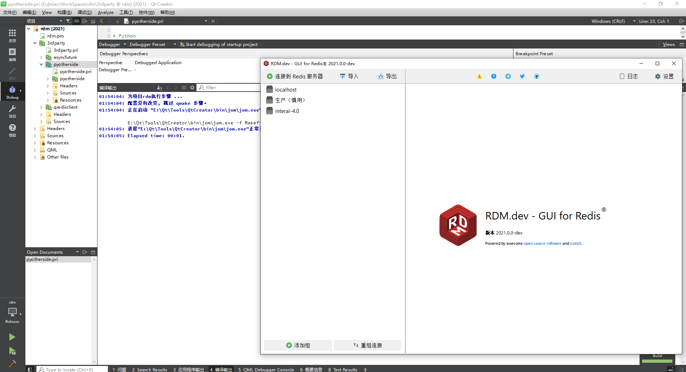

查了一下，这是因为`Qt Creator`编译好的exe程序是没有关联依赖库的，需要使用`windeployqt`这个工具将依赖库部署过来。也就是说编译成功只是倒数第二步或者第三步。

### `windeployqt`对rdm.exe进行部署

将编译好的`rdm.exe`拷贝到`rdm/build/windows/installer/resources`目录中，并在此目录中编写`assemble.bat`文件。

文件内容如下:

```powershell
@echo off
:: 执行依赖库引入
:: 注意: 命令中的windeployqt是一个exe程序, 
:: 该程序的目录需要按实际Qt的安装位置修改, 
:: \src\qml目录也是按源码解压时所在位置的绝对路径修改
set windeployqt=E:\Qt\5.15.2\msvc2019_64\bin\windeployqt.exe
set src_path=E:\WorkSpace\rdm\src
%windeployqt% --no-angle --no-opengl-sw --no-compiler-runtime --no-translations --release --force --qmldir %src_path%\qml rdm.exe
:: 删除一些不必要的文件
rmdir /S /Q .\qmltooling
rmdir /S /Q .\QtGraphicalEffects
del /Q  .\imageformats\qtiff.dll
del /Q  .\imageformats\qwebp.dll
echo Assemble complate! Press every key exit.
pause > nul
```

现在双击`rdm/build/windows/installer/resources/rdm.exe`能正常运行了

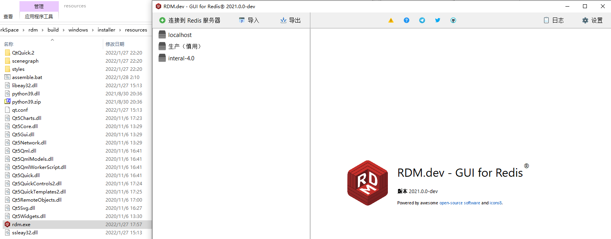


### 处理软件分发

到现在位置软件已经`RDM`算是编译完成并且可以在本机中分发了，为什么说是本机呢？因为程序运行运行所需的python.dll和python.zip依赖包旨在本机中存在，如果分发找其他其上一定会报错缺少`python.dll`而无法运行。因此需要将这两个依赖从[[python-embed]](https://www.python.org/ftp/python/3.9.7/python-3.9.7-embed-amd64.zip)包中复制到`rdm/build/windows/installer/resources/`中（`python-embed`是pytohn的一种机制提供了C/C++调用python代码进行交互）。这样分发到其他机器上就可以正常使用了。但是点击右上角的【日志】按钮出现如下信息，感觉似乎哪个依赖包不正确。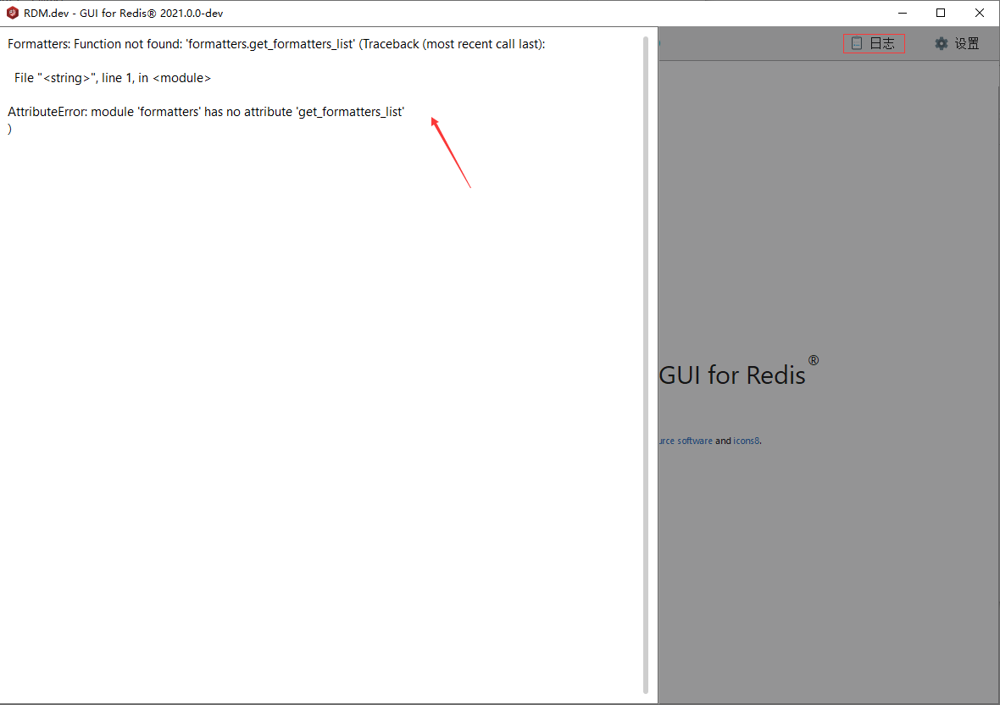

经查原因如下：

	这是对redis的value值进行解析的扩展没有找到, 比如显示为二进制, msgpack等, 默认已经自带文本, json, 十六进制。添加对应的处理依赖包

只需要将`rdm/src/py/formatters/`所有`.py`文件拷贝到`rdm/build/windows/installer/resources/formatters`目录下就想了。即在`git-bash`执行：

`cp -rv rdm/src/py/formatters/*.py rdm/build/windows/installer/resources/formatters/` 

为了节省空间可以在`formatters`目录中执行如下命令

```shell
rdm/build/windows/installer/resources/formatters/ $ python -m compileall -b .
rdm/build/windows/installer/resources/formatters/ $ rm -rf *.py
```

至此，一个绿色版的`rdm`就生成了。为了方便可以执行如下命令进行打包：

```shell
rdm/build/windows/installer/resources $ 7z a -tzip -mx9 resp-noinstaller-2022.zip * -r
7-Zip [32] 15.12 : Copyright (c) 1999-2015 Igor Pavlov : 2015-11-19

Scanning the drive:
42 folders, 736 files, 60113121 bytes (58 MiB)

Creating archive: rdm-2021.zip

Items to compress: 778


Files read from disk: 736
Archive size: 24479939 bytes (24 MiB)
Everything is Ok
```

### 制作安装包

根据我自己的使用习惯做出`noinstaller`就可以了。但是rdm项目的作者很用心居然提供了`NSI`脚本，那我就来试一下将rdm制作成安装包。

首先需要下载[`nsis`](https://sourceforge.net/projects/nsis/files/NSIS%203/3.08/nsis-3.08.zip/download)这个软件，它是制作软件安装包的工具，目前版本是*v3.08*同样我也是下载的`noInstaller`版本。运行`NSIS.exe`

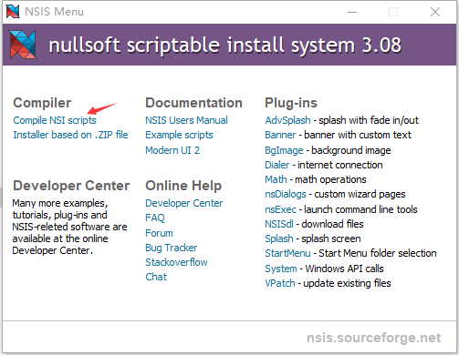

我们有`NSI`脚本因此选择这个

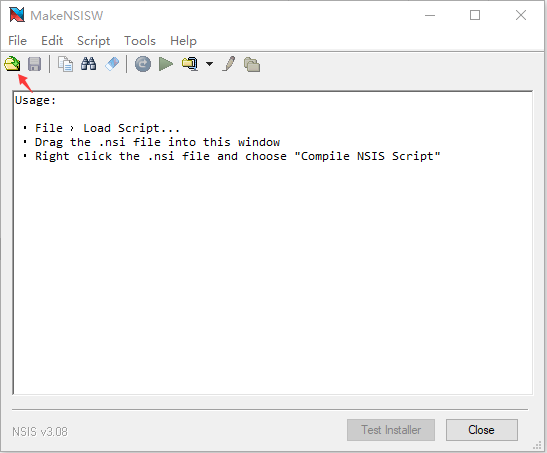

对`installer.nsi`脚本进行修改

```shell
rdm/build/windows/installer $ sed -i '/^Name "RDM"/a\# version\n!define VERSION "2021.10.0"' installer.nsi # branch 2021
rdm/build/windows/installer $ sed -i '/^Name "RESP/a\# version\n!define VERSION "2022.1.0"' installer.nsi # branch 2022
```

请注意此处`VERSION`必须定义写成'x.x.x'这样的格式。不然`NSIN`在打包过程中就会报错：

	Processed 1 file, writing output (x86-unicode):
	Adding plug-ins initializing function... Done!
	Error: invalid VIProductVersion format, should be X.X.X.X
	Error - aborting creation process

通过两种打包方式可以看出`NSIN`的压缩比例明显占优，就看各自喜好。我个人喜欢`noinstaller`

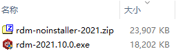


编译好的[rdm下载](https://github.com/ShoJinto/shojinto.github.io/releases/tag/rdm)，另外文章中的截图由于使用`2021`和`2022`两个分支的代码进行过编译，因此截图看着有点儿混乱，不过对编译总体流程没有影响。


### 致谢

[RDM作者](https://github.com/uglide/RedisDesktopManager)

[Redis Desktop Manager 2020.2 Windows 源码编译](https://blog.csdn.net/aileitianshi/article/details/107920808)幸亏此参考

[Visual C++ Redistributable for Visual Studio各版本的官方链接](https://blog.csdn.net/ZxqSoftWare/article/details/104993372)

[Windows10+QT5.9+VS2017编译并打包RedisDesktopManager](https://zhuanlan.zhihu.com/p/82747325)

[源码编译Redis Desktop Manager参考](http://www.cxyzjd.com/article/n447194252/107932227)

