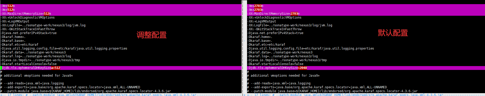
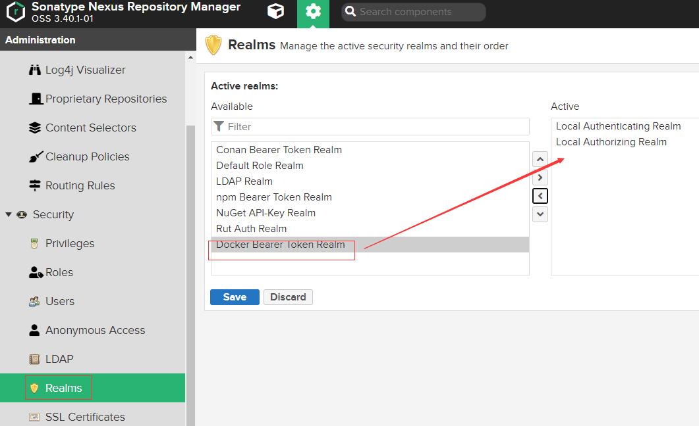
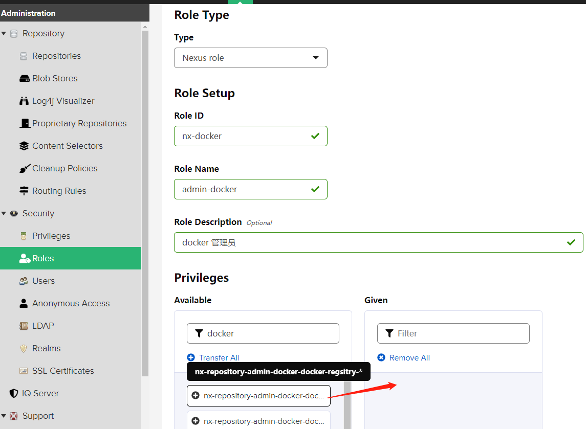
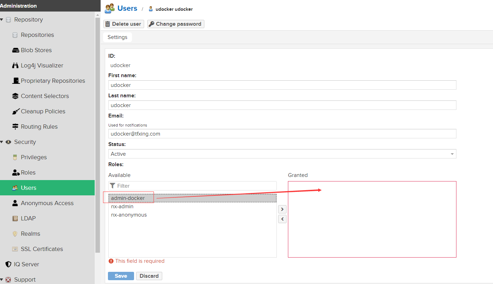
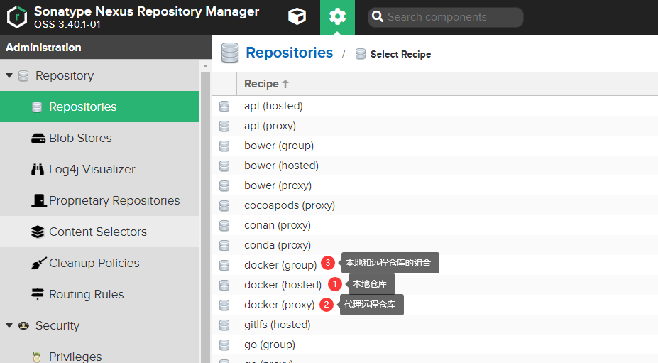
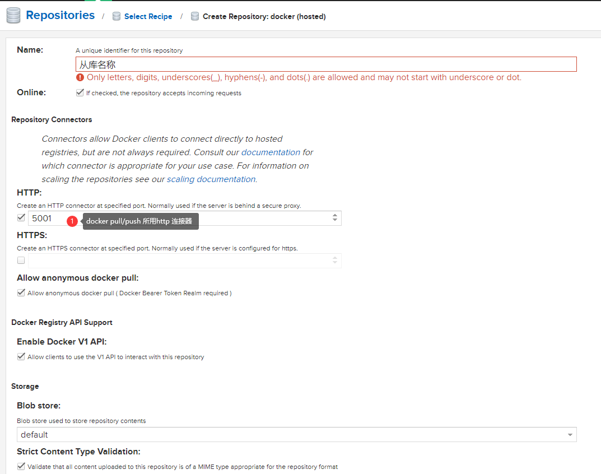

# Nexus-sonatype-搭建docker 镜像私有仓库

公司网络隔离策略变动导致之前搭建的docker hub不能直接访问。为了解决环境中存在的这一问题，决定在环境中搭建docker私有仓库。对比harbor和nexus3后决定采用nexus3。采用nexus3的主要原因是用于安装镜像仓库的服务器资源非常的low之后1个core和2g memory。

### 服务器配置：

|   系统版本 | CentOS7.7 |
| ---------: | --------- |
|  CPU核心数 | 1core     |
|   内存大小 | 2G        |
| 服务器数量 | 1台       |

### 下载软件包：

[Linux版本Nexus下载地址](https://download.sonatype.com/nexus/3/nexus-3.40.1-01-unix.tar.gz)

### 官方文档：

https://help.sonatype.com/repomanager3/product-information/download

### nexus安装：

由于服务器内存严重不足，所以需要调整nexus的启动参数，不然nexus就启动不起来。

nexus目录结构：

```shell
$ tree -L 3 /data/app/nexus/
/data/app/nexus/
├── nexus-3.40.1-01
│   ├── bin
│   │   ├── contrib
│   │   ├── nexus
│   │   ├── nexus.rc
│   │   └── nexus.vmoptions # 启动参数配置文件
│   ├── deploy
│   ├── etc 
│   ├── lib
│   ├── NOTICE.txt
│   ├── OSS-LICENSE.txt
│   ├── PRO-LICENSE.txt
│   ├── public
│   ├── replicator
│   └── system
├── sonatype-work # 数据存储目录
    └── nexus3

```




调整了nexus的内存参数之后为了以防物理内存不够用，接下来还需要调整启用swap，不然这条小机器就宕机了。详细调整说明请移步：https://www.digitalocean.com/community/tutorials/how-to-add-swap-on-centos-7

我这边操作步骤：

```shell
$ dd if=/dev/zero of=/swapfile count=4096 bs=1024k # 创建swap文件
$ mkswap /swapfile # 格式化swap文件
$ swapon /swapfile # 开启swap
$ swapon -s
$ blkid /swapfile  |awk -F'"' '{print "UUID="$2" "$4" "$4" sw 0 0 "}' >> /etc/fstab # swap分区开机自加载
$ cat "vm.swappiness = 10 \n#vm.vfs_cache_pressure = 50" >> /etc/sysctl.conf # 调整swap分区使用参数，因为机器配置确实太low调整一下swap参数，让服务器可能好过一点儿。。。
```

nexus安装部分结束！！！


### nexus配置

首先需要激活nexus的docker beaer token realm



配置docker镜像仓库的用户角色



新建用户并分配角色



新建docker hosted仓库，左侧菜单：Repostory -$ Repostories -$ Create repostory



这里选择hosted，建立本地私有仓库



至此镜像仓库配置完毕

### nginx代理nexus

由于docker是采用push和pull采用ssl方式因此需要配置nginx的ssl。因此需要生成自签名的证书，由于go在17.x之后对ssl证书进行了升级：需要在证书中包含SANs信息才能被通过。因此需要生成包含SANs信息的证书。生成脚本如下：

```shell
$ openssl genrsa -out ca.key 2048 # 生成key

# 生成crt
$ openssl req -new -x509 -days 3650 -key ca.key \
-subj "/C=CN/ST=SC/L=CD/O=example, Inc./CN=example Docker Registry CA" \
-out ca.crt

# 生成证书请求文件
$ openssl req -newkey rsa:2048 -nodes \
-keyout registry.example.com.key \
-subj "/C=CN/ST=SC/L=CD/O=example, Inc./CN=*.example.com" \
-out registry.example.com.csr

#生成自签名证书
$ openssl x509 -req -extfile <(printf "subjectAltName=DNS:example.com,DNS:registry.example.com") \
-days 3650 -in registry.example.com.csr -CA ca.crt -CAkey ca.key -CAcreateserial \
-out registry.example.com.crt
```


nginx配置文件：

```nginx
$ cat /etc/nginx/conf/vhost/registry.example.com.conf
server {
  listen 443 ssl;
  server_name registry.example.com;
  access_log      logs/registry-access.log;

  # SSL
  ssl_certificate /mnt/app/nginx/conf/key/registry.example.com.crt;
  ssl_certificate_key /mnt/app/nginx/conf/key/registry.example.com.key;

  # Recommendations from https://raymii.org/s/tutorials/Strong_SSL_Security_On_nginx.html
  ssl_protocols TLSv1.1 TLSv1.2;
  ssl_ciphers 'EECDH+AESGCM:EDH+AESGCM:AES256+EECDH:AES256+EDH';
  ssl_prefer_server_ciphers on;
  ssl_session_cache shared:SSL:10m;

  # disable any limits to avoid HTTP 413 for large image uploads
  client_max_body_size 0;


  location /v2 {
     proxy_set_header Host $host;
     proxy_set_header X-Forwarded-Proto $scheme;
     proxy_set_header X-Forwarded-Port $server_port;
     proxy_set_header X-Forwarded-For $proxy_add_x_forwarded_for;
     proxy_set_header Upgrade $http_upgrade;
     proxy_set_header X-Real-IP $remote_addr;
     proxy_read_timeout 900s;
     proxy_pass http://x.x.x.x:5001;
   }

  location /v1 {
     proxy_set_header Host $host;
     proxy_set_header X-Forwarded-Proto $scheme;
     proxy_set_header X-Forwarded-Port $server_port;
     proxy_set_header X-Forwarded-For $proxy_add_x_forwarded_for;
     proxy_set_header Upgrade $http_upgrade;
     proxy_set_header X-Real-IP $remote_addr;
     proxy_read_timeout 900s;
     proxy_pass http://x.x.x.x:5001;
  }

   location / {
     proxy_set_header Host $host:$server_port;
     proxy_set_header X-Real-IP $remote_addr;
     proxy_set_header X-Forwarded-For $proxy_add_x_forwarded_for;
     proxy_set_header X-Forwarded-Proto "https";
     proxy_pass http://x.x.x.x:8081;
   }

}
```


由于证书是自签名的，因此还需要在docker客户端上安装对应的ca证书。安装也很简单，只需要将上面生成的ca.crt文件拷贝到docker客户端所在系统的`/etc/docker/certs.d/<对应registry域名或者ip$/` 目录下就行了。操作演示：

```shell
$ mkdir  -p /etc/docker/certs.d/registry.example.com/
$ cp certs/ca.crt /etc/docker/certs.d/registry.example.com/
```

### 验证

```shell

$ docker login registry.example.com
Username: udocker
Password:
Login Succeeded

$  docker logout registry.example.com
Removing login credentials for registry.example.com


$ docker rmi 4ce
Untagged: registry.example.com/library/example-devops:v1
Untagged: registry.example.com/library/example-devops@sha256:5d29550866a38af9fbd68583a465227424f99a6d74b01bc8dcab108723d0a78f
Deleted: sha256:4ceb67ae105888be4884855dcedf58b61e86142d5e30f0c06a16293cd7e736b5

$ docker pull registry.example.com/library/example-devops:v1
v1: Pulling from library/example-devops
530afca65e2e: Already exists
cc8c14b1a767: Already exists
1f40cdde4dbc: Already exists
b2dc0f78b277: Already exists
4ee964fed49e: Already exists
0a21e09e15e0: Already exists
2f830ef42252: Already exists
cadb37b0c40c: Already exists
4f4fb700ef54: Already exists
c74ef55cb264: Already exists
Digest: sha256:5d29550866a38af9fbd68583a465227424f99a6d74b01bc8dcab108723d0a78f
Status: Downloaded newer image for registry.example.com/library/example-devops:v1
registry.example.com/library/example-devops:v1

$ docker images
REPOSITORY                                    TAG       IMAGE ID       CREATED      SIZE
registry.mmyueche.com/library/example-devops   prod      7ff252f4b729   2 days ago   790MB
registry.example.com/library/example-devops     v1        4ceb67ae1058   6 days ago   388MB

$ docker push registry.example.com/library/example-devops:v1
The push refers to repository [registry.example.com/library/example-devops]
3b6a7021ab10: Layer already exists
5f70bf18a086: Layer already exists
31e145e3b4e1: Layer already exists
4e9c2055435c: Layer already exists
d03c32b5a731: Layer already exists
7ed14f14c0d3: Layer already exists
d6219b31634f: Layer already exists
8aee288c0534: Layer already exists
dc6b8d77e79b: Layer already exists
ec34fcc1d526: Layer already exists
v1: digest: sha256:5d29550866a38af9fbd68583a465227424f99a6d74b01bc8dcab108723d0a78f size: 2417
```


至此利用nexus搭建docker私有仓库的所有步骤完毕，总结一下：nexus上的用户角色配置以及docker-registry的ssl认证是关键。操作过程中一定要主力体会和理解！！！