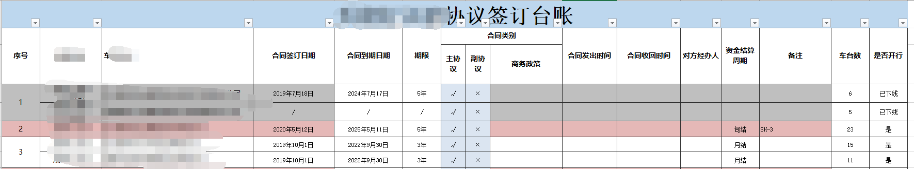
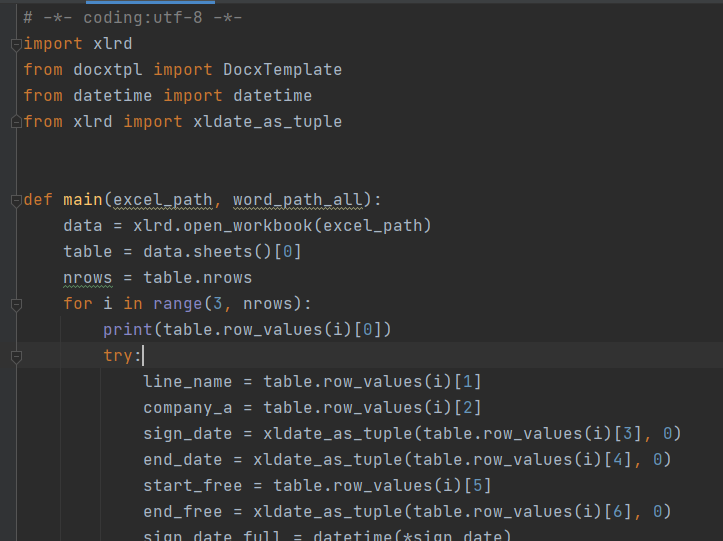

# Python-docx-操作word文档实战

### 概述

公司同时有一堆word版本的合同需要进行续期签订，里面牵涉到诸如：合同到期时间、收费费率之类关键信息需要进行调整。针对一个合同来说手动修改即可，但是有一堆这样的合同要操作。很容易出错并且出现错误也很难排查，为了降低人力成本这里采用python-docx模块来帮助同事完成一系列的重复工作。同事只需要维护合同模板和相应的excle表格即可。

- excle 存储到期时间，费率收取等信息
- docx 合同模板

这里采用的是`python-docxtpl`模块，使用方法详见：[https://www.cnblogs.com/feifeifeisir/p/14701066.html](https://www.cnblogs.com/feifeifeisir/p/14701066.html)

### 思路

1. 根据`excel`中的信息编写`.docx`模板文件
2. 从`excel`中读取关键信息生成更新的内容字典
3. 利用`python-docxtpl`的`rander`方法对模板中的关键信息进行替换
4. 保存修改的内容

### 实操

安装处理模块
```shell
pip install xlrd python-docxtpl
```

Excel内容形如：



使用`xlrd`读取excle中的内容，代码形如：




往word文档中插入特殊字符
处理特殊字符：应用场景详见[https://blog.csdn.net/wi162yyxq/article/details/108431881](https://blog.csdn.net/wi162yyxq/article/details/108431881)

为了实现这个需求我这边可谓是煞费苦心！！！
最开始找了`python-docx`模块根据[特殊字符处理](https://blog.csdn.net/wi162yyxq/article/details/108431881)了解到`openXML`并找到一些[稍详细描述](https://blog.csdn.net/liuqixuan1994/article/details/104486600/)通过这两篇文章我可以轻松操作word的dom节点，但是还不知道如何将修改后的dom树回写到word的document对象中，因此还是不能完成往word中插入**特殊字符的需求**。好在有强大的Google帮忙，最终找到了一篇关于[往word中添加checkbox的博客](http://jike.in/?qa=1146252/xml-how-can-i-insert-a-checkbox-form-into-a-docx-file-using-python-docx)了解到`python-docx`模块处理word的逻辑，完成了向word中添加特殊字符的需求。后来又找到一篇[日本朋友写的博客](https://www.shibutan-bloomers.com/python_library_python-docx/2247/)图文并茂简直不要太香！！这里引用一下他的图片以期更直观的理解`python-docx`模块:


通过以上资料，我这边往`word`中添加特殊字符的代码如下:
```python
from docx import Document
from docx.oxml.shared import qn, OxmlElement
doc = Document('123.docx')
'''
根据python-docx的官方文档:https://python-docx.readthedocs.io/en/latest/api/text.html#paragraph-objects
doc > paragraph > run
'''
for p in doc.paragraphs:
    # 定位到需要插入特殊字符的位置
    if "□" in p.text and "abc" in p.text:
        # print(p.runs[0].text)
        run_id = 0 # 因为paragraph包含多个run，这里的标记是对run进行定位
        for run in p.runs:
            if "□" in run.text:
                tag = p._p[run_id] # 找到需要被替换的run
                # 利用OxmlElement生成一个特殊字符
                right_mark = OxmlElement('w:sym')
                right_mark.set(qn('w:font'), 'Wingdings 2')
                right_mark.set(qn('w:char'), 'F052')
                # 将特殊字符添加到run中
                tag.append(right_mark)
                # 清理到旧的run，因为已经插入了一个新的run所以这里可以直接清理，以达到替换的效果
                run.clear()
            run_id += 1
doc.save('xxxx.docx')
```
由于`DocxTemplate`不能直接读入去内存中的docx文档，因此插入特殊字符和从excel中更新信息两个步骤需要借助中间文档`xxxx.docx`进行，以及最终合同需要分三个情况生成，因此以上方式显得非常臃肿。那么有没有办法让代码更加干练呢？答案是肯定的。通过查阅资料以上步骤其实可以借助python-docxtpl模块的强大能来来实现，其实都是源于jinja2的模板语法。

*以下是所有操作的基础*

```python
正常的Jinja 2语法只有%的普通标签，而docxtpl的类语法包含%p，%tr，%tc，%r

%p：段落，即docx.text.paragraph.Paragraph对象

%tr：表格中的一行，即docx.table._Row对象

%tc：表格中的一列，即docx.table._Column对象

%r：段落中的一个片段，即docx.text.run.Run对象

通过使用这些标记，python-docx-template将真正的Jinja 2标记放入文档的XML源代码中的正确位置。

另外，需注意，这四种标签，起始标签不能在同一行，必须在不同的行上面。


```


代码实现：
```python
doctmp = DocxTemplate('123.docx')
"""
根据业务情况，word模板中的jinja2语法如下：
 {{ right_mark }} □
参考：
https://www.cnblogs.com/feifeifeisir/p/14701066.html
https://docxtpl.readthedocs.io/en/latest/#jinja2-like-syntax
因为合同分为主副两份，根据情况最终生成的合同会有如下情况：
    1. 主副
    2. 主
    3. 副
因此，合同模板大致结构如：
     
    主合同内容
    
     
    副合同内容 
    
要如何生成合同内容只需要传递相应的内容给合同模板即可
"""
context = {
    "main": True,
    "secondary": False,
    "right_mark": '<w:sym w:font="Wingdings 2" w:char="F052"/>', # word中的“对号”，利用 docxtpl中的 {%r 专属标签实现
}
doctmp.render(context)
doctmp.save("a123.docx")
print('done.')

```


