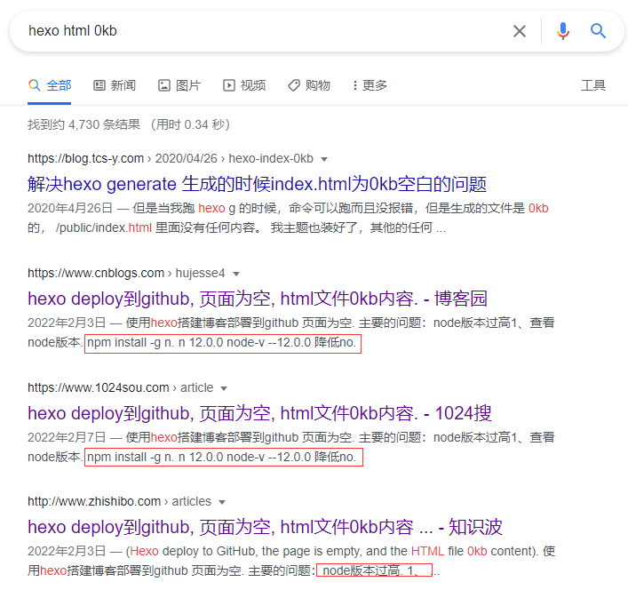

在写[上一篇文章](/2022/02/16/Python-docx-操作word文档实战/)的时候发现Jekyll与文章的部分标记有冲突，导致github编译不通过，最终博客不能更新。

这两天打算将公司内部的知识库也通过静态网页的方式进行共享，由于之前Jekyll的坑所以这次选择了hexo作为生成引擎。发现Hexo确实比Jekyll要简单太多了，文档中文友好。简直不要太香！

贴一个Hexo的官方链接：[https://hexo.io/zh-cn/docs](https://hexo.io/zh-cn/docs/)

这次选择的主题是hexo官方主题市场中的[`GEEK`](https://github.com/sanjinhub/hexo-theme-geek)做了一些自定义修改，就这样上线吧！！！


在`Github Action`的过程中还自己给自己挖了一个坑：主题是直接从github上clone的，导致`git add`的时候自动识别成了`submodule`我的本意是不去让主题作为git的子项目，所以把主题里面的`.git`目录手动给删除了。这就导致`Action`的时候无法获取主题的代码从而导致生成的静态文件`html`全部为空文件。Google搜索 `hexo html 0kb`得到的答案都是：



一开始最开始以为知道到了问题，但是我的这个问题不是node版本的所导致。尝试了好几次，查询到Hexo的官方英文文档[github-pages](https://hexo.io/docs/github-pages)也没有关于这些的说法，也不像中文文档关于github-pages是通过[Travis CI](https://travis-ci.com)完成，或者使用 [hexo配合github action 自动构建（多种形式）](https://segmentfault.com/a/1190000040767893) 的方式。英文版本直接上用的`GitHub Action`既然Hexo官方有如此丝滑的解决方案那就果断采用之。但是CI后html文档内容为空的问题仍然没有解决。无意中发现GitHub远程仓库中的`themes/geeok`目录为空，一下子恍然大悟：*主题内容为空当然会导致生成的结果为空！*

至此问题原因找到，接下来就是进行如下操作，让主题内容被git跟踪执行如下命令即可：

```
git rm --cache themes/geek  # 清除git对themes的缓存设置
git add themes # 重新添加git跟踪
```

这里是关于`submodule`问题的决绝方法：[git出现fatal: Pathspec 'xxx' is in submodule 'xxx'的解决方法](https://smileusd.github.io/2018/03/21/git-submodule-problem/)

最后push最新的变动到github仓库，`Github Action`就自动发布了。